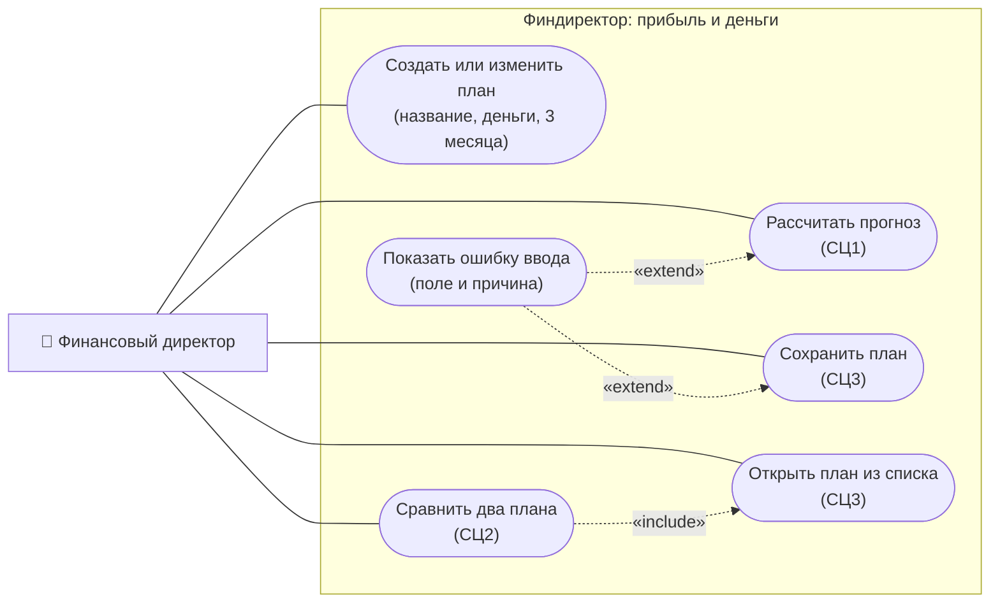

# Диаграмма вариантов использования (ЛР1-Д3)

Действующее лицо — финансовый директор; прямоугольник — граница приложения; овалы — сценарии ЛР1-Д2.

```mermaid
flowchart LR
    CFO["👤 Финансовый директор"]

    subgraph APP["Финдиректор: прибыль и деньги"]
        UC0(["Создать или изменить план<br/>(название, деньги, 3 месяца)"])
        UC1(["Рассчитать прогноз<br/>(СЦ1)"])
        UC2(["Сравнить два плана<br/>(СЦ2)"])
        UC3(["Сохранить план<br/>(СЦ3)"])
        UC4(["Открыть план из списка<br/>(СЦ3)"])
        UCE(["Показать ошибку ввода<br/>(поле и причина)"])
    end

    CFO --- UC0
    CFO --- UC1
    CFO --- UC2
    CFO --- UC3
    CFO --- UC4
    UCE -. "«extend»" .-> UC1
    UCE -. "«extend»" .-> UC3
    UC2 -. "«include»" .-> UC4
```
